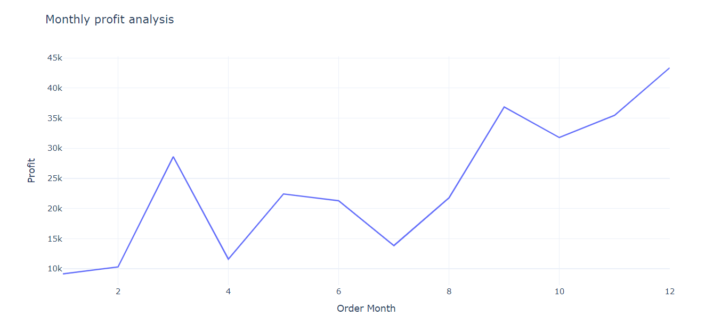
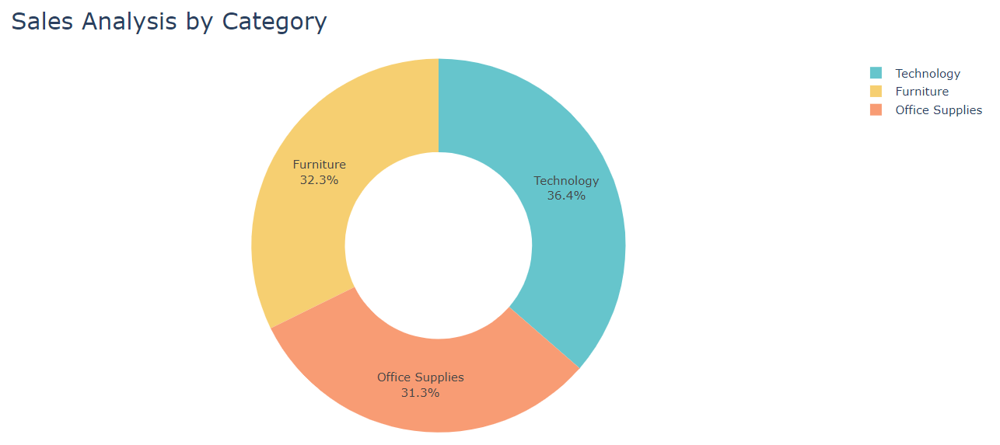

# 📊 E-Commerce Sales Analysis (EDA Project)

## Project Overview

This project focuses on **Exploratory Data Analysis (EDA)** of an E-commerce sales dataset to uncover meaningful insights into **sales performance and monthly trends**.
Using **Python, Pandas, and Plotly**, the analysis highlights how sales evolve over time through clean data processing and interactive visualizations.

The goal of this project is to demonstrate **practical data analysis skills**, including data cleaning, aggregation, and storytelling through visual insights.

---

## Objectives

* Analyze overall sales performance of the E-commerce platform
* Identify and interpret **monthly sales trends**
* Perform data cleaning and aggregation using Pandas
* Build **interactive time-series visualizations** using Plotly
* Strengthen hands-on EDA and data visualization skills

---

## Tech Stack

* **Python**
* **Pandas** – Data manipulation & aggregation
* **Plotly** – Interactive data visualization
* **Jupyter Notebook**

---

## Analysis Performed

* Cleaned and preprocessed raw sales data
* Extracted **Order Month** from order dates
* Grouped sales data by month using Pandas
* Aggregated total monthly sales
* Visualized trends using **interactive Plotly line charts**

---
## Insights
* Maximum number of sales occurred in November.
* Technology category generates the highest revenue, but Furniture shows lower profit margins.
* Certain sub-categories have high sales but low profitability, indicating cost inefficiencies.
* Corporate segment contributes significantly to profit compared to other customer segments.

----

## Visualizations








> ⚠️ **Note:**
> Plotly visualizations may not render in GitHub’s notebook preview.
> Please run the notebook locally to explore the **fully interactive charts**.

---


## 🚀 How to Run the Project

1. **Clone the repository**

```bash
git clone <repo-link>
```

2. **Install dependencies**

```bash
pip install pandas plotly
```

3. **Open the notebook**

```bash
jupyter notebook
```

4. **Run all cells** to view the analysis and interactive charts.

---

## 💡 Key Learnings

* Hands-on experience with **Exploratory Data Analysis (EDA)**
* Practical understanding of **time-series sales analysis**
* Improved skills in **data aggregation using Pandas**
* Experience creating **interactive visualizations with Plotly**
* Built a **portfolio-ready data analysis project**

---

## 👤 Author

**Petrim Prashanthi**
Aspiring Data Analyst
Python | SQL | Excel | Data Visualization

📫 *Open to internships and entry-level data analyst opportunities*


